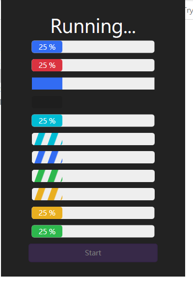

# Trying_Handy_Org_Custom_Controls
### 前言
參考這部影片 [Trying_Handy_Org_Custom_Controls](https://www.youtube.com/watch?v=8uW5uY6PvDQ)
以及其 [Source Code](https://github.com/Abel13/CustomControlsHandyOrg)

### 練習項目
* [HandyControl package](https://github.com/HandyOrg/HandyControl)
    * 目前流行的 UI 套件 *HandyControl*
      * WaveProgressBar
        * 
      * CircleProgressBar
        * 
      * Gravatar
        * 
* WPF .net Core 的 ProgressBar
    * ProgressBar 的 Value 在使用上 , 目前(.Net Core 3.1)有精確度的問題. 
      * e.g. 28 在顯示上可能會變成 28.00000000
      * 實際使用上可能需要 override 其 ControllTemplate 
      * 或者選擇 , 預設不顯示數值的 Style , 例如
        * ProgressBarFlat
        * ProgressBarFlat4ProgressButton
        * ProgressBarInfoStripe
        * ProgressBarPrimaryStripe
        * ProgressBarSuccessStripe
        * ProgressBarWarningStripe
      * 範例圖
        * 
* MVVM 架構
    * Mdoel
    * View
    * ViewModel
    * Command

### 參考資源
[手把手教你如何使用HandyControl，一款开源WPF控件神器](https://blog.csdn.net/qqwe13/article/details/85227311)

[《Dotnet9》系列-开源C# WPF控件库3《HandyControl》强力推荐](https://blog.csdn.net/qq_45533841/article/details/105878149?utm_medium=distribute.pc_relevant.none-task-blog-baidujs_title-2&spm=1001.2101.3001.4242)

[WPF实现背景透明磨砂，并通过HandyControl组件实现弹出等待框](https://blog.csdn.net/wdw984/article/details/92803240?utm_medium=distribute.pc_relevant.none-task-blog-BlogCommendFromBaidu-3.control&depth_1-utm_source=distribute.pc_relevant.none-task-blog-BlogCommendFromBaidu-3.control)

[WPF 使用 HandyControl 给 ListView 添加漂亮的表头效果](https://blog.csdn.net/lindexi_gd/article/details/108807459)

[[C#.NET][Thread] 執行緒定時器](https://dotblogs.com.tw/yc421206/2011/01/30/21141)

[WPF Bind to itself](https://stackoverflow.com/questions/1906587/wpf-bind-to-itself)

[HandyControl package](https://github.com/HandyOrg/HandyControl)

